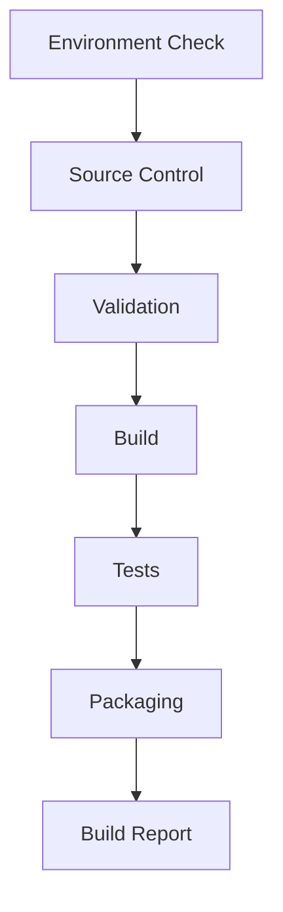

<p align="center"> 
    
</p>

<p align="center">
  
  
  
</p>

# 🚀 CI/CD Pipeline Simulator

A **modular, configuration-driven CI/CD pipeline simulator built entirely in PowerShell**.

This project demonstrates how modern build pipelines operate internally within enterprise environments by simulating a full continuous integration and delivery workflow.

The system replicates common DevOps pipeline stages such as **environment validation, source synchronization, compilation, automated testing, artifact packaging, and build reporting**.

It was designed to showcase **release engineering practices, modular scripting architecture, and automated build orchestration**.



---

# Quick Start

### Option 1 — View CI Execution

Open the **GitHub Actions** tab in the repository to see the pipeline running automatically on commit.

Artifacts, logs, and execution results are available for each run.

---

### Option 2 — Run Locally

Clone the repository and execute the pipeline script.

```bash
git clone https://github.com/CodeNode-Automation/pipeline-simulator.git
cd pipeline-simulator
powershell ./pipeline.ps1
```

The pipeline will simulate a full CI/CD workflow locally.

---

## 🏗️ Project Architecture
```text
├── pipeline.ps1
│
├── config/
│   └── pipeline.config.json
│
├── modules/
│   ├── Environment.psm1
│   ├── SourceControl.psm1
│   ├── Validation.psm1
│   ├── Build.psm1
│   ├── Test.psm1
│   ├── Package.psm1
│   ├── Logging.psm1
│   └── Report.psm1
│
├── artifacts/
│
├── build/
│
└── logs/
```

---

## 🖥️ Execution Preview

The simulator provides high-fidelity console output with real-time status tracking:

```text
[12-03-2026 09:08:41] [INFO ] >>> Step 1: Checking Environment...
[12-03-2026 09:08:41] [INFO ] [1/7] Environment Validation
[12-03-2026 09:08:41] [INFO ]   [PASS] git installed
[12-03-2026 09:08:41] [INFO ]   [PASS] artifacts directory ready
[12-03-2026 09:08:42] [DEBUG]   Build target: x64 | Configuration: Release
```

---

## 🎯 Key Features & Technical Highlights

* **High-Fidelity Realism:** Unlike static scripts, this simulator performs real git operations, generates physical artifacts, and calculates precise millisecond-level execution metrics.
* **Modular Architecture:** Pipeline logic is separated into single-responsibility PowerShell modules (`.psm1`), ensuring high maintainability and testability.
* **Configuration-Driven:** Execution logic and parameters are decoupled from the code and managed via `pipeline.config.json`.
* **Comprehensive Lifecycle Simulation:** Mimics a real-world software delivery pipeline from source validation to packaging.
* **Traceability:** Generates detailed build reports and execution logs for every run.

---

## ⚙️ Pipeline Stages

The simulator executes sequentially through the standard CI/CD lifecycle:

1. **Environment Validation:** Checks that required tools (like Git) are installed. It also ensures all configured project directories exist or creates them if missing.
2. **Source Control Update:** Performs a live git pull to sync the environment and extracts metadata (Commit Hash, Author, Branch) for the build manifest.
3. **Validation Checks:** Verifies that the expected project directory structure and the centralized configuration file (`pipeline.config.json`) are present in the environment.
4. **Build Stage:** Simulates multi-component compilation with randomized stutter-steps and generates intermediate .dll objects before linking the final executable.
5. **Automated Tests:** Runs a simulated test suite where each test has a randomized chance of passing or failing. It then outputs the results and calculates the total execution duration.
6. **Packaging:** Generates a simulated application executable and compresses the build directory into a timestamped `.zip` archive for release.
7. **Build Report:** Aggregates the pipeline's pass/fail results, test metrics, and artifact locations into a final `build_report.txt` file.

---

# Logging System

A centralized logging utility captures all pipeline events.

Features include:

* Timestamped logs
* Severity levels
* Console color output
* Persistent log file storage

Logs are written to:

```
logs/pipeline.log
```

Example entry:

```
[12-01-2026 15:32:11] [INFO ] Pipeline started
```

---

# Generated Outputs

During execution the pipeline generates several artifacts:

```
artifacts/
    ProjectName_timestamp.zip

build/
    ProjectName_build.exe

logs/
    pipeline.log
    build_report.txt
```

These outputs simulate the results of a real CI/CD build pipeline.

---

# GitHub Actions Integration

The pipeline is designed to run automatically using GitHub Actions.

Typical workflow triggers:

* Push events
* Pull requests

The CI runner executes:

```
pipeline.ps1
```

and uploads build artifacts upon completion.

---

# Technologies Used

* PowerShell
* Git
* GitHub Actions
* JSON Configuration
* Modular Script Architecture

---

# Design Goals

This project was created to demonstrate practical DevOps engineering concepts:

* CI/CD pipeline orchestration
* Infrastructure as Code principles
* Modular automation scripting
* Logging and traceability
* Artifact lifecycle management
* Configuration-driven systems

---

# Future Improvements

Potential enhancements include:

* Real test framework integration (Pester)
* Parallel test execution
* Pipeline caching
* Multi-environment deployment simulation
* Container build stages
* Docker integration
* Deployment targets

---

# License

This project is intended for **educational and demonstration purposes**.

---

# Author

Developed as a practical demonstration of CI/CD pipeline design using PowerShell automation.

